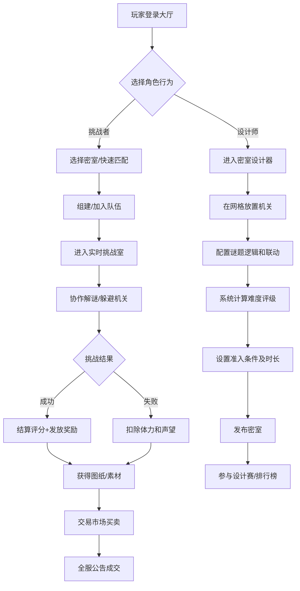

## 1. 产品概述

多人在线密室逃脱设计与挑战系统是一款融合UGC创作与协作解谜的Web游戏平台。玩家可设计自己的密室关卡，放置各类机关与谜题，其他玩家组队挑战，通过实时协作完成逃脱。

- 主要目的：提供UGC密室创作平台，支持多人实时协作解谜，构建创作者经济生态
- 目标用户：解谜游戏爱好者、UGC创作者、多人协作玩家社群
- 产品价值：降低密室创作门槛，实现"设计-挑战-交易-竞技"的完整闭环

## 2. 核心功能

### 2.1 用户角色

| 角色 | 注册方式 | 核心权限 |
|------|----------|----------|
| 设计师玩家 | 用户名/邮箱注册 | 创建密室、上架图纸、参与评审 |
| 挑战者玩家 | 用户名/邮箱注册 | 组队挑战、交易素材、参与排行榜 |
| 系统管理员 | 后台账号 | 管理违规内容、发放赛季奖励 |

### 2.2 功能模块

1. **大厅主页**: 热门密室推荐、活动入口、个人状态面板、快速组队
2. **密室设计器**: 网格编辑、机关库、谜题配置、难度预览、准入条件设置
3. **实时挑战室**: 多人位置同步、机关触发、紧急事件、状态面板、倒计时
4. **结算页面**: 评分明细、经验奖励、图纸掉落、失败惩罚
5. **交易市场**: 图纸/素材买卖、定价建议、全服公告
6. **排行榜中心**: 周榜展示、维度筛选、PDF报告导出
7. **设计赛专区**: 赛事提交、实时评审、赛季奖励

### 2.3 页面详情

| 页面名称 | 模块名称 | 功能描述 |
|-----------|-------------|---------------------|
| 大厅主页 | 热门密室轮播 | 展示Top5密室，支持点击进入挑战 |
| 大厅主页 | 快速组队面板 | 显示在线房间，一键加入 |
| 大厅主页 | 个人状态条 | 体力/声望/经验值实时显示 |
| 密室设计器 | 网格画布 | 16x12可编辑网格，支持拖拽放置机关 |
| 密室设计器 | 机关库侧边栏 | 分类展示激光、陷阱、谜题面板、门、宝箱等 |
| 密室设计器 | 属性配置面板 | 配置机关参数、谜题逻辑、联动关系 |
| 密室设计器 | 难度评级面板 | 实时显示难度星级、建议准入等级 |
| 密室设计器 | 准入条件设置 | 设置最低等级、最大队伍人数、挑战时长 |
| 实时挑战室 | 游戏画布 | 渲染密室网格、玩家位置、机关状态 |
| 实时挑战室 | 队伍状态栏 | 显示队员血量、位置、受伤次数 |
| 实时挑战室 | 事件通知栏 | 显示紧急事件（机关失控、密室崩塌）及倒计时 |
| 实时挑战室 | 进度面板 | 剩余时间、解密进度、机关触发统计 |
| 结算页面 | 评分雷达图 | 通关时间/死亡次数/解密完成度/协作度 |
| 结算页面 | 奖励发放 | 经验值、稀有图纸、金币 |
| 交易市场 | 商品列表 | 展示在售图纸和素材，支持筛选 |
| 交易市场 | 上架面板 | 卖家定价，系统显示7天均价建议区间 |
| 交易市场 | 全服公告轮播 | 显示高价成交信息 |
| 排行榜中心 | 多维度榜单 | 通关率榜、评分榜、创意榜 |
| 排行榜中心 | PDF导出 | 导出密室热度图和趋势报告 |
| 设计赛专区 | 赛事信息 | 当前赛季主题、截止时间、奖励展示 |
| 设计赛专区 | 提交面板 | 提交密室作品参赛 |
| 设计赛专区 | 实时评审面板 | 自动匹配评审，实时更新评分 |

## 3. 核心流程

## 4. 用户界面设计

### 4.1 设计风格
- **主色调**: 深炭灰 `#1a1410` 背景 + 古铜金 `#c9a227` 主强调 + 锈红色 `#8b2c2c` 危险色
- **辅助色**: 幽绿 `#3d6b4f`（机关激活）+ 冰蓝 `#4a7fb5`（解谜提示）
- **按钮风格**: 浮雕金属质感，边框古铜描边，悬停时微亮发光
- **字体**: 标题使用 Cinzel Decorative（哥特复古风），正文使用 Cormorant Garamond（优雅衬线）
- **布局风格**: 非对称面板布局，模拟古旧羊皮纸质感的信息卡片，齿轮/铆钉装饰元素
- **图标风格**: 线性+填充混合，带金属锈迹纹理，使用 lucide-react 定制色

### 4.2 页面设计概览

| 页面名称 | 模块名称 | UI风格描述 |
|-----------|-------------|-------------|
| 大厅主页 | 顶部导航 | 深色金属横条，古铜色文字，铆钉装饰 |
| 大厅主页 | 密室轮播 | 羊皮纸卡片悬浮，悬停时发光边框，翻页动画 |
| 密室设计器 | 网格画布 | 深灰网格线，悬停格子高亮，机关拖拽带虚影 |
| 密室设计器 | 机关库 | 分类Tab，图标卡片，选中时古铜色描边 |
| 实时挑战室 | 游戏画布 | 暗色迷雾效果，玩家位置带光晕脉冲 |
| 实时挑战室 | 事件栏 | 红色渐变告警条，抖动动画，倒计时数字放大 |
| 结算页面 | 评分雷达 | 半透明玻璃态，古铜描边，数据点脉冲动画 |
| 交易市场 | 商品卡片 | 羊皮纸质感，价格标签古铜色徽章 |

### 4.3 响应式
- 桌面端优先设计（1440px基准）
- 平板端：侧边栏收起为抽屉，网格自适应缩放
- 移动端：简化布局，优先展示核心交互区域

### 4.4 动效设计
- 页面加载：齿轮旋转过渡，文字逐字淡入
- 机关放置：落地金属撞击感 + 微粒子扩散
- 紧急事件触发：屏幕红色边缘闪烁 + 低频震动效果
- 谜题解开：绿色光波扩散 + 金属解锁音效视觉化
