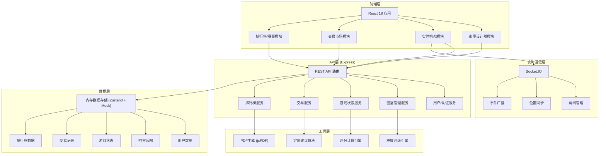
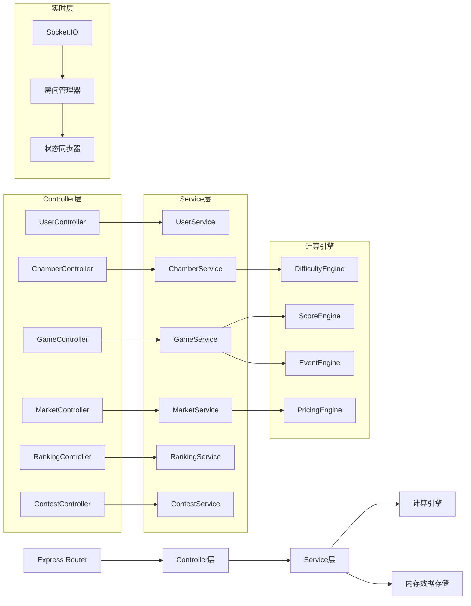
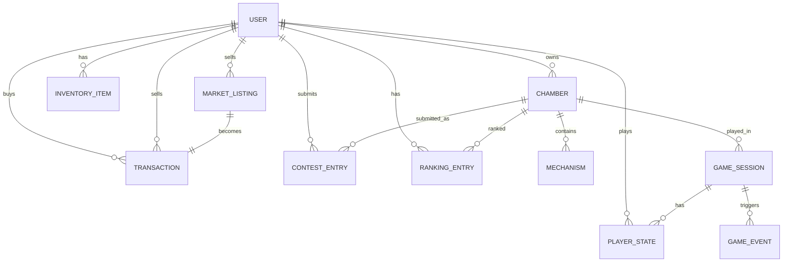

## 1. 架构设计



## 2. 技术说明

- **前端**: React@18 + TypeScript + tailwindcss@3 + vite@5 + zustand@4
- **后端**: Express@4 + Socket.IO@4 (实时通信)
- **初始化工具**: vite-init (react-express-ts 模板)
- **数据存储**: 前端 Zustand 状态管理 + 后端内存存储 (mock 数据)
- **图标库**: lucide-react
- **图表**: recharts (雷达图、趋势图、热度图)
- **PDF导出**: jspdf + html2canvas
- **路由**: react-router-dom@6

## 3. 路由定义

| 路由 | 页面组件 | 用途 |
|-------|---------|---------|
| `/` | Home | 大厅主页 - 密室推荐、快速组队 |
| `/designer` | Designer | 密室设计器 - 网格编辑、机关放置 |
| `/chamber/:id` | Chamber | 实时挑战室 - 多人游戏 |
| `/result/:sessionId` | Result | 结算页面 - 评分、奖励 |
| `/market` | Market | 交易市场 - 图纸/素材买卖 |
| `/ranking` | Ranking | 排行榜中心 - 榜单、PDF导出 |
| `/contest` | Contest | 设计赛专区 - 赛事、评审 |
| `/profile` | Profile | 个人中心 - 背包、状态 |

## 4. API 定义

### 4.1 TypeScript 类型定义

```typescript
// 核心实体类型
interface User {
  id: string;
  username: string;
  level: number;
  exp: number;
  stamina: number;
  reputation: number;
  coins: number;
  inventory: InventoryItem[];
}

interface InventoryItem {
  id: string;
  type: 'blueprint' | 'material';
  itemId: string;
  quantity: number;
  rarity: 'common' | 'rare' | 'epic' | 'legendary';
}

interface Mechanism {
  id: string;
  type: 'laser' | 'trap' | 'puzzle' | 'door' | 'chest' | 'sensor';
  x: number;
  y: number;
  config: Record<string, any>;
  linkedTo?: string[];
}

interface Chamber {
  id: string;
  ownerId: string;
  name: string;
  description: string;
  gridWidth: number;
  gridHeight: number;
  mechanisms: Mechanism[];
  difficulty: number; // 1-10
  minLevel: number;
  maxPlayers: number;
  timeLimit: number; // 秒
  createdAt: number;
  stats: ChamberStats;
}

interface ChamberStats {
  plays: number;
  clears: number;
  avgScore: number;
  rating: number;
}

interface GameSession {
  id: string;
  chamberId: string;
  players: PlayerState[];
  startTime: number;
  timeRemaining: number;
  puzzleProgress: number;
  injuries: number;
  events: GameEvent[];
  status: 'playing' | 'won' | 'lost';
}

interface PlayerState {
  userId: string;
  x: number;
  y: number;
  hp: number;
  injuries: number;
  isAlive: boolean;
}

interface GameEvent {
  id: string;
  type: 'malfunction' | 'collapse' | 'bonus';
  triggeredAt: number;
  resolved: boolean;
  data: Record<string, any>;
}

interface MarketListing {
  id: string;
  sellerId: string;
  itemType: 'blueprint' | 'material';
  itemId: string;
  rarity: string;
  price: number;
  suggestedPrice: { min: number; max: number; avg: number };
  createdAt: number;
}

interface Transaction {
  id: string;
  listingId: string;
  buyerId: string;
  sellerId: string;
  price: number;
  itemId: string;
  timestamp: number;
}

interface RankingEntry {
  userId: string;
  username: string;
  category: 'clearRate' | 'score' | 'creativity';
  value: number;
  rank: number;
  week: string;
}

interface ContestEntry {
  id: string;
  chamberId: string;
  contestantId: string;
  contestId: string;
  scores: { judgeId: string; score: number; comment?: string }[];
  avgScore: number;
  submittedAt: number;
}
```

### 4.2 后端 API 端点

```typescript
// 用户相关
GET    /api/users/:id           // 获取用户信息
POST   /api/users/auth          // 登录/注册
GET    /api/users/:id/inventory // 获取背包

// 密室相关
GET    /api/chambers            // 密室列表（筛选/分页）
GET    /api/chambers/:id        // 密室详情
POST   /api/chambers            // 创建密室
PUT    /api/chambers/:id        // 更新密室
DELETE /api/chambers/:id        // 删除密室
POST   /api/chambers/:id/calculate-difficulty // 计算难度

// 游戏会话
POST   /api/sessions            // 创建游戏会话
GET    /api/sessions/:id        // 会话状态
POST   /api/sessions/:id/end    // 结束会话
GET    /api/sessions/:id/result // 获取结算结果

// 市场交易
GET    /api/market              // 商品列表
POST   /api/market              // 上架商品
DELETE /api/market/:id          // 下架商品
POST   /api/market/:id/buy      // 购买商品
GET    /api/market/suggest-price // 获取定价建议

// 排行榜
GET    /api/ranking             // 排行榜数据
GET    /api/ranking/export      // 导出PDF报告

// 设计赛
GET    /api/contest/current     // 当前赛季
POST   /api/contest/submit      // 提交作品
GET    /api/contest/entries     // 参赛列表
POST   /api/contest/:entryId/score // 评分
```

## 5. 服务端架构图



## 6. 数据模型

### 6.1 ER 图



### 6.2 初始化 Mock 数据

```typescript
// 示例用户
const mockUsers: User[] = [
  {
    id: 'u1',
    username: '迷室工匠',
    level: 15,
    exp: 3200,
    stamina: 80,
    reputation: 950,
    coins: 12500,
    inventory: [
      { id: 'inv1', type: 'blueprint', itemId: 'bp_laser_net', quantity: 1, rarity: 'epic' },
      { id: 'inv2', type: 'material', itemId: 'mat_copper', quantity: 50, rarity: 'common' }
    ]
  }
];

// 示例密室机关模板
const mechanismTemplates = [
  { type: 'laser', name: '激光发射器', icon: 'Zap', baseDifficulty: 15 },
  { type: 'trap', name: '地刺陷阱', icon: 'AlertTriangle', baseDifficulty: 10 },
  { type: 'puzzle', name: '数字谜题面板', icon: 'Puzzle', baseDifficulty: 25 },
  { type: 'door', name: '机关门', icon: 'DoorOpen', baseDifficulty: 5 },
  { type: 'chest', name: '宝藏箱', icon: 'Package', baseDifficulty: 20 },
  { type: 'sensor', name: '压力传感器', icon: 'Gauge', baseDifficulty: 8 }
];
```
